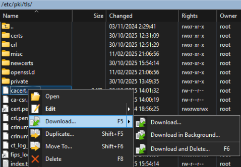
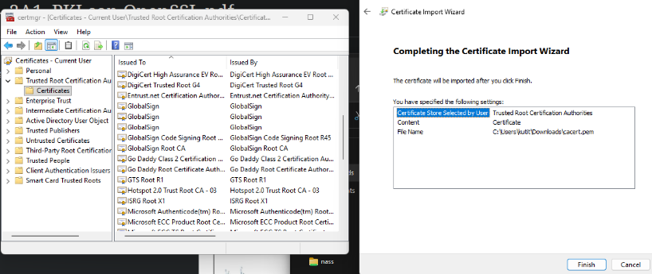
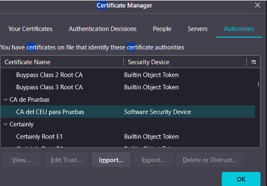

# PRACTICA PKI PARA HTTPS

En esta práctica se aborda el protocolo HTTPS (Hypertext Transfer Protocol over Secure Socket Layer), que es la base del servicio WWW seguro. También se trata la certificación X.509 y las infraestructuras PKI. Cubriremos los siguientes objetivos:

- Descripción de las conexiones HTTPS
- Presentación de la librería OpenSSL
- Configuración del modulo SSL/TLS de Apache. Servidores virtuales.
- Definición de una CA (Autoridad de Certificación) y gestión de certificados
- Autentificación de clientes Web mediante certificados

Usaremos una máquina Linux con distribución Rocky para construir la PKI y configurar servidores virtuales HTTPS. Se recomienda usar tanto la distribución Rocky como la Ubuntu que para la configuración de los servidores HTTPS. A la hora de realizar las pruebas HTTPS usaremos nuestro
propio equipo de usuario, o cualquier otro que cuente con interface gráfico y navegador web


---

## 1. Comprobar fecha y hora de la máquina virtual. Si no está bien, actualizar la fecha y hora del sistema (importante porque si no fallará al emitir los certificados)
>**IMPORTANTE:** Esto es importante para la maquina que emite los certificados

Nos fijamos que la fecha y hora esten correctas:
```bash
date
timedatectl
```
Si la zona horaria no fuera correcta y además NTP no estuviera activo entonces deberíamos ejecutar la siguiente serie de comandos:

```bash
sudo timedatectl set-timezone Europe/Madrid # (poner la zona horaria)
timedatectl # (ver la información de la zona y fecha)
sudo dnf install –y chrony # (insalar el servicio chrony – cliente moderno de NTP)
sudo systemctl enable –now chronyd # (habilitar el servicio)
system status chronyd # (mirar el status del demonio)
chronyc tracking # (verificar sincronización)
sudo chronyc makestep # (Forzar la sincronización inmediata)
Timedatectl # (Verificar la información)
```
---
---

## 2. Instalacion de Apache y de SSL
---

En la **Rocky** instalamos ambos **Apache y SSL**
```bash
# Apache
sudo dnf update
sudo dnf install httpd -y
sudo systemctl enable httpd
sudo systemctl start httpd # Comprobar que funciona con un curl o en la maquina windows

# SSL
sudo dnf install mod_ssl -y  # Se crea automaticamente un certificado autofirmado en /etc/pki/tls/certs/localhost.cert y la clave en **/etc/pki/tls/private/localhost.key
```

Verificamos que está levantado el puerto 443 (hay que reiniciar el servicio de httpd si nos se descargan a la vez):
```bash
sudo systemctl restart httpd
sudo ss -tlnp | grep httpd
```
---

En la **Ubuntu** descargamos **Apache**:
```bash
sudo apt update
sudo apt install apache2 -y
sudo systemctl start apache2
sudo systemctl enable apache2
```
---
---

## 3. Creacion de la CA, creacion de claves pub y pem, y un cert autofirmado. TODO ESTO EN LA MAQUINA CA (ROCKY)

Tenemos que crear una autoridad (CA) propia con los siguientes parametros:
- **CountryName**: ES
- **StateOrProvinceName**: Madrid
- **LocalityName**: Alcorcon
- **OrganizationName**: CA de Pruebas

Empezamos creando la estructura necesaria:
```bash
cd /etc/pki/tls
sudo mkdir crl
sudo mkdir newcerts
sudo touch index.txt # # Base de datos de certificados emitidos
echo 01 > serial # Número de serie para el próximo certificado
echo 01 > crlnumber # Número de serie para la próxima CRL
```

Editamos el openssl.conf (/etc/pki/tls/openssl.cnf) para poner la ruta correcta y los valores predeterminados (no hace falta ponerlos, se pueden poner cuando se crea el certificado):
```cnf
# ...

[ CA_default ]

dir             = /etc/pki/tls          # ESTE DE AQUI!!!!!
certs           = $dir/certs            # Where the issued certs are kept
crl_dir         = $dir/crl              # Where the issued crl are kept
database        = $dir/index.txt        # database index file.
#unique_subject = no                    # Set to 'no' to allow creation of
                                        # several certs with same subject.

#### MAS PARA ABAJO ####

[ req_distinguished_name ]
countryName                     = Country Name (2 letter code)
countryName_default             = ES # Esto!!!
countryName_min                 = 2
countryName_max                 = 2

stateOrProvinceName             = State or Province Name (full name)
stateOrProvinceName_default     = Madrid # Esto!!!

localityName                    = Locality Name (eg, city)
localityName_default            = Alcorcon # Esto!!!

0.organizationName              = Organization Name (eg, company)
0.organizationName_default      = CA de Pruebas # Y esto!!!

```

Y ahora creamos una clave privada con passphrase (1234):
```bash
sudo openssl genrsa -aes256 -out private/cakey.pem 2048
# te pide que metas una passphrase, meter 1234
```

Y ahora creamos el certificado con los datos predeterminados (realmente no hace falta meterlos en el archivo se pueden poner ahora) y con CN = “CA del CEU para Pruebas” (cacert.pem):
```bash
sudo openssl req -new -key private/cakey.pem -out ca-csr.pem
```
Nos saldra esto, al haber puesto los valores predeterminados podemos solo darle a enter, si no se pueden poner ahora. **IMPORTANTE: Si hay que poner el Common Name (CN)**:
```txt
Enter pass phrase for private/cakey.pem:
You are about to be asked to enter information that will be incorporated
into your certificate request.
What you are about to enter is what is called a Distinguished Name or a DN.
There are quite a few fields but you can leave some blank
For some fields there will be a default value,
If you enter '.', the field will be left blank.
-----
Country Name (2 letter code) [ES]:
State or Province Name (full name) [Madrid]:
Locality Name (eg, city) [Alcorcon]:
Organization Name (eg, company) [CA de Pruebas]:
Organizational Unit Name (eg, section) []:
Common Name (eg, your name or your server's hostname) []:CA del CEU para pruebas # ESTO !!!
Email Address []:

Please enter the following 'extra' attributes
to be sent with your certificate request
A challenge password []:
An optional company name []:
```
```bash
sudo openssl req -x509 -extensions v3_ca -in ca-csr.pem -out cacert.pem -key private/cakey.pem -days 3652
```

Creamos el listado de certificados revocados (crl.pem) que inicialmente estará vacío:
```bash
sudo openssl ca -gencrl -out crl.pem
```

La estructura por ahora es la siguiente:
```txt
[root@CARocky tls]# tree
.
├── cacert.pem
├── ca-csr.pem
├── cert.pem -> /etc/pki/ca-trust/extracted/pem/tls-ca-bundle.pem
├── certs
│   ├── ca-bundle.crt -> /etc/pki/ca-trust/extracted/pem/tls-ca-bundle.pem
│   ├── ca-bundle.trust.crt -> /etc/pki/ca-trust/extracted/openssl/ca-bundle.trust.crt
│   └── localhost.crt
├── crl
├── crlnumber
├── crlnumber.old
├── crl.pem
├── ct_log_list.cnf
├── fips_local.cnf -> /etc/crypto-policies/back-ends/openssl_fips.config
├── index.txt
├── misc
├── newcerts
├── openssl.cnf
├── openssl.d
├── private
│   ├── cakey.pem
│   └── localhost.key
└── serial

6 directories, 16 files
```
---
---

## 4. Pareja de claves pub/priv RSA de 2048 bits para el server web y un certificado firmado por nuestra CA.

**CN y Nombre alternativo SAN**: www.miservidor.es

Editamos /etc/pki/tls/openssl.cnf para poner los nombres alternativos del SAN (lo metemos al final del archivo):
```conf
[ server_SAN ]
basicConstraints = CA:FALSE
keyUsage = nonRepudiation, digitalSignature, keyEncipherment
extendedKeyUsage = serverAuth
subjectAltName = @alt_names

[ alt_names ]
DNS.1 = www.miservidor.es
DNS.2 = miservidor.es
```

Creamos la clave privada para el server de 2048 bits:
```bash
sudo openssl genrsa -out server-key.pem 2048
```

Y creamos el CSR y ponemos el CommonName = www.miservidor.es:
```bash
sudo openssl req -new -key server-key.pem -out server-csr.pem
```
>**IMPORTANTE:** Poner el CN coreecto, en este caso www.miservidor.es

Y ahora firmamos el CSR con nuestra CA:
```bash
sudo openssl ca -extensions server_SAN -in server-csr.pem -out server-crt.pem -days 730

# nos pide darle a 'y' para firmar
```

Lo siguiente es configurar el servidor Apache.

Creamos el directorio para el DocumentRoot, /projects/miservidor y un archivo index.html:
```bash
sudo mkdir /projects
sudo mkdir /projects/miservidor
sudo vim /projects/miservidor/index.html
```

Y creamos el archivo **/etc/httpd/conf.d/miservidor.conf**:
```apache
# Para que se redirija HTTP a HTTPS
<VirtualHost *:80>
        Servername www.miservidor.es
</VirtualHost>

<VirtualHost *:443>
        ServerName www.miservidor.es
        DocumentRoot "/projects/miservidor"

        SSLEngine on
        SSLCertificateFile /etc/pki/tls/server-crt.pem
        SSLCertificateKeyFile /etc/pki/tls/server-key.pem
        SSLCertificateChainFile /etc/pki/tls/server-csr.pem

        SSLCACertificateFile /etc/pki/tls/cacert.pem

        <Directory /projects/miservidor>
                Options Indexes FollowSymLinks
                AllowOverride None
                Require all granted
        </Directory>
</VirtualHost>
```

Comprobamos la config y reniniciamos apache:
```bash
sudo apachectl configtest
sudo systemctl restart httpd
sudo systemctl status httpd
```

---
Para hacer las comprobaciones en nuestra maquina windows, pasamos el 'cacert.pem' con WinSCP:



Y ponemos el cacert.pem en el Trusted Root Certification Authorities (windows ->
manage user certificates):



Y en Firefox, en certificate manager:




Y modificamos el archivo hosts de windows **(c:/windows/system32/drivers/etc/hosts)** y metemos lo siguiente:
```txt
192.168.217.147 www.miservidor.es miservidor.es https://miservidor.es http://miservidor.es
```

Y si ponemos el dominio en el buscador deberia de salir sin problemas y sin avisos.

---
---

## 5. Certificados de CLIENTE con departamentos

### Crear un certificado para **Carmen Cabrera (CN)**, del departmento de **Contabilidad (OU)**, firmado por la CA.

Creamos el certificado de Carmen firmado por la CA:
```bash
cd /etc/pki/tls
sudo openssl req -new -keyout carmen-cabrera-key.pem -out carmen-cabrera-csr.pem -noenc

```
>**Organizational Unit Name (eg, section) [ ]: Contabilidad**

>**Common Name (eg, your name or your server's hostname) [ ]: Carmen Cabrera**

Metemos al final del archivo de openssl.cnf la extension/directiva [ user ]:
```conf
[ user ]
basicConstraints = CA:FALSE
subjectKeyIdentifier = hash
authorityKeyIdentifier = keyid,issuer:always
keyUsage = digitalSignature
extendedKeyUsage = clientAuth
```

Firmamos con la CA para obtener el crt:
```bash
sudo openssl ca -extensions user -in carmen-cabrera-csr.pem -out carmen-cabrera-crt.pem -days 730

# Y ponemos la passphrase de la CA (era 1234)
# Y firmamos -> y
```

Y creamos el archivo carmen-cabrera-crt.p12:
```bash
sudo openssl pkcs12 -export -in carmen-cabrera-crt.pem -inkey carmen-cabrera-key.pem -out carmen-cabrera-crt.p12

# Y ponemos una password para la exportacion (la que se usa para el buscador)
```

Modificamos el archivo /etc/httpd/conf.d/miservidor.conf y metemos que se requiera verificacion:
```apache
<VirtualHost *:80>
        Servername www.miservidor.es
</VirtualHost>

<VirtualHost *:443>
        ...

        # Esto
        SSLVerifyClient require 
         
        <Directory /projects/miservidor>
                ...
        </Directory>
</VirtualHost>
```
>Ahora nos pedira un cert valido para acceder

Y reiniciamos apache:
```bash
sudo systemctl restart httpd
```

**Descargamos el certificado .p12 con WinSCP como antes y lo importamos a FireFox en "Your Certificates", nos pedira la password de la exportacion a .p12**

Y usando ese certificado podremos entrar a la pagina.

---
---

## 6. Acceso a paginas por departamento

### Queremos tener diferentes directorios del server web que sean accesible dependiendo del departamento (OU).

1. **CONTABILIDAD**: Carmen Cabrera
2. **MARKETING**: Mario Martinez

Creamos un certificado como antes, para Mario Martinez de Marketing (OU):
```bash
cd /etc/pki/tls

# Primero el CSR (Poner el departamento en 'Organizational Unit Name'!!)
sudo openssl req -new -keyout mario-martinez-key.pem -out mario-martinez-csr.pem -noenc

# Firmado por la CA (pide password de la CA)
sudo openssl ca -extensions user -in mario-martinez-csr.pem -out mario-martinez-crt.pem -days 730

# Lo pasamos a PKCS12 (ponemos password para el cert)
sudo openssl pkcs12 -export -in mario-martinez-crt.pem -inkey mario-martinez-key.pem -out mario-martinez-crt.p12
```

Creamos los diferentes directorios para diferentes departamentos :
```bash
mkdir /projects/miservidor/contabilidad
mkdir /projects/miservidor/marketing

# metemos archivos index.html para cada uno, con algun texto para diferenciar
vim /projects/miservidor/contabilidad/index.html
vim /projects/miservidor/marketing/index.html
```

Metemos lo necesario en el archivo de **/etc/httpd/conf.d/miservidor.conf** :
```apache
<VirtualHost *:443>
        # ...
        <Location /contabilidad/>
                SSLRequire ( %{SSL_CLIENT_S_DN_OU} eq "Contabilidad")
        </Location>

        <Location /marketing/>
                SSLRequire ( %{SSL_CLIENT_S_DN_OU} eq "Marketing")
        </Location>
        # ...
</VirtualHost>
```
>**IMPORTANTE:** Las mayusculas importan cuando se pone el directorio en "Location", si no se pone exactamente como se llama no hace las comprobaciones!!

Y reiniciamos el server:
```bash
sudo systemctl restart httpd
```

>Ahora al intentar acceder a cada pagina nos pide certificado, si no eres del departamento correcto, sale **Forbidden**.

---
---

## 7. Revocacion de Certificados

Para revocar un certificado hacemos lo siguiente:
```bash
# Lo revocamos (pide password de la CA)
sudo openssl ca -revoke mario-martinez-crt.pem

# Y actualizamos el crl.pem (pide password de la CA)
sudo openssl ca -gencrl -out crl.pem
```

Y ponemos lo siguiente en **/etc/httpd/conf.d/miservidor.conf** :
```apache
<VirtualHost *:443>
        # ...

        SSLVerifyClient require
        # Estas dos lineas
        SSLCARevocationCheck chain
        SSLCARevocationFile /etc/pki/tls/crl.pem

        <Location /Contabilidad/>
                # ...
</VirtualHost>
```
>**IMPORTANTE:** Tiene que estar despues de 'SSLVerifyClient require'!!

Y reiniciamos apache:
```bash
sudo systemctl restart httpd
```

#### Ahora al intentar usar ese certificado no dejara

## 8. Firmar certificados de otros servidores

### En la maquina Ubuntu que tenemos 

La maquina tiene los siguientes dominios:
- www.pruebas.com
- pruebas.com
- www.pruebas.net
- pruebas.net

Primero creamos una clave y CSR (donde sea, yo lo hice en ~) :
```bash
sudo openssl genrsa -out pruebas.key 2048
```

Creamos un archivo SAN 'pruebas.cnf':
```conf
[req]
distinguished_name = req_distinguished_name
req_extensions = v3_req

[req_distinguished_name]

[v3_req]
subjectAltName = @alt_names

[alt_names]
DNS.1 = pruebas.com
DNS.2 = www.pruebas.com
DNS.3 = pruebas.net
DNS.4 = www.pruebas.net
```

Y creamos el CSR con el **CN = pruebas.com** :
```bash
sudo openssl req -new -key pruebas.key -out pruebas.csr -config pruebas.cnf -subj "/CN=pruebas.com"

# tendriamos que tener: pruebas.csr, pruebas.key y pruebas.cnf
```

Copiamos los archivos pruebas.csr y pruebas.cnf a la maquina Rocky con la CA:
```bash
sudo scp pruebas.csr root@<IP_de_CA>:/etc/pki/tls
sudo scp pruebas.cnf root@<IP_de_CA>:/etc/pki/tls\
```

Y **EN LA ROCKY CON LA CA** lo firmamos:
```bash
cd /etc/pki/tls

sudo openssl x509 -req -in pruebas.csr -CA cacert.pem -CAkey private/cakey.pem -CAcreateserial -out pruebas.crt -days 365 -sha256 -extfile pruebas.cnf -extensions v3_req
```

Y enviamos el certificado (pruebas.crt) a la Ubuntu:
```bash
sudo scp pruebas.crt root@<IP_maquina>:~
```

**Dentro de la Ubuntu** activamos SSL:
```bash
sudo a2enmod ssl
```

Y ponemos lo siguiente en **/rtc/apache2/sites-availible/000-default.conf** :
```apache
<VirtualHost *:80>
    ServerName www.pruebas.com
</VirtualHost>

<VirtualHost *:443>
    ServerName www.pruebas.com
    ServerAlias pruebas.com www.pruebas.net pruebas.net

    # crear si no existe 
    DocumentRoot /projects/pruebas 

    SSLEngine on
    SSLCertificateFile /root/pruebas.crt
    SSLCertificateKeyFile /root/pruebas.key
    SSLCertificateChainFile /root/pruebas.csr

    # crear si no existe
    <Directory /projects/pruebas>
        DirectoryIndex index.html
        AllowOverride All
        Require all granted
    </Directory>

</VirtualHost>
```

Y reiniciamos apache:
```bash
sudo systemctl restart apache2
```

Y modificamos el archivo hosts de windows **(c:/windows/system32/drivers/etc/hosts)** y metemos lo siguiente:
```txt
192.168.217.148 www.pruebas.com pruebas.com www.pruebas.net pruebas.net
```
>Ahora al intentar entrar a estos dominios tendriamos que ver que HTTPS funciona y que ha sido firmado por nuestra CA


